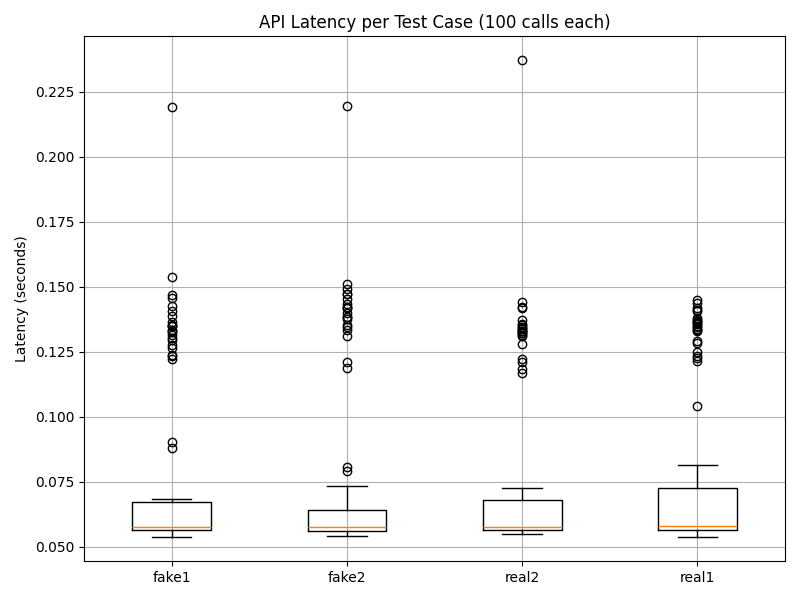

# ECE444-prac5-ml-deployment

This repository contains a Flask-based REST API that serves a machine learning model for **fake news detection**, deployed using **AWS Elastic Beanstalk**.

---

## 🌐 Live Application
Access the deployed API here:  
👉 [http://pra5-ml-api-env.eba-mvu2cj2p.us-east-2.elasticbeanstalk.com](http://pra5-ml-api-env.eba-mvu2cj2p.us-east-2.elasticbeanstalk.com)

---

## 🧠 Description
The application loads a pre-trained text classification model (`basic_classifier.pkl`) and a `count_vectorizer.pkl` to predict whether a news headline is **FAKE** or **REAL**.

### API Endpoints
- `GET /` — Health check, returns `{ "status": "ok" }`
- `POST /predict` — Accepts JSON input and returns the model prediction

---

## 🧪 Example Usage

**Request:**
```bash
curl -X POST http://pra5-ml-api-env.eba-mvu2cj2p.us-east-2.elasticbeanstalk.com/predict \
  -H "Content-Type: application/json" \
  -d '{"text": "This is fake news"}'


